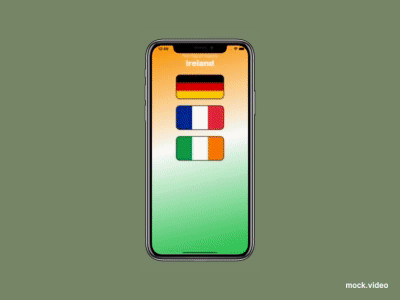

# GuessTheFlag
App made by following **[100DaysOFSwiftUI](https://www.hackingwithswift.com/100/swiftui/)** Day 20 - 22 and following challenge

It's a quiz game to select correct flag image from the given options.

## What i learned

1. Implicit and explicit animation in SwiftUI using 
2. State variables
3. Showing Alerts in SwiftUI
4. [GeometryEffect](https://developer.apple.com/documentation/swiftui/geometryeffect) to create shake animation
5. Animating multiple properties using [AnimatableData](https://developer.apple.com/documentation/swiftui/animatable/3046497-animatabledata)
6. Created 3d rotation animation using [rotation3DEffect](https://www.hackingwithswift.com/quick-start/swiftui/how-to-rotate-a-view-in-3d)
7. Animation overriding

